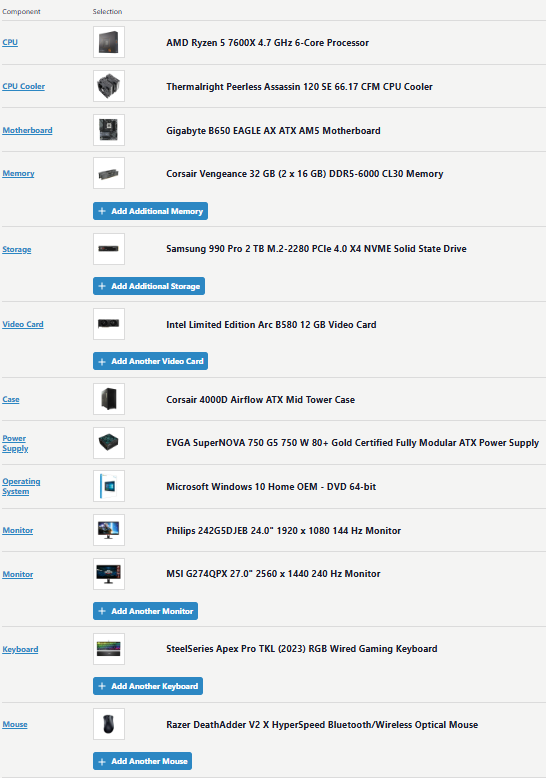
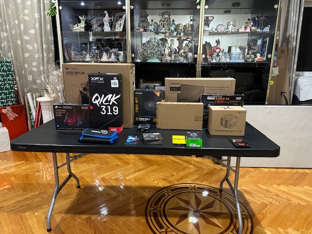
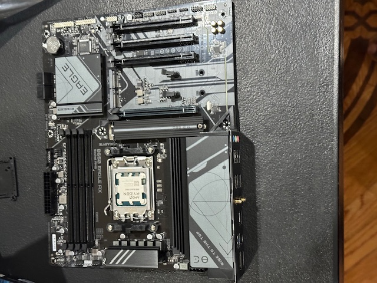
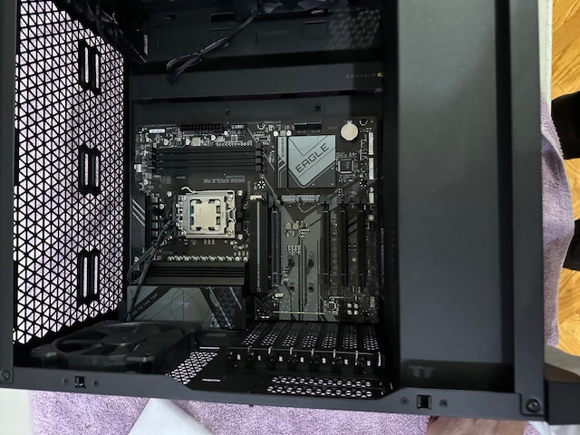
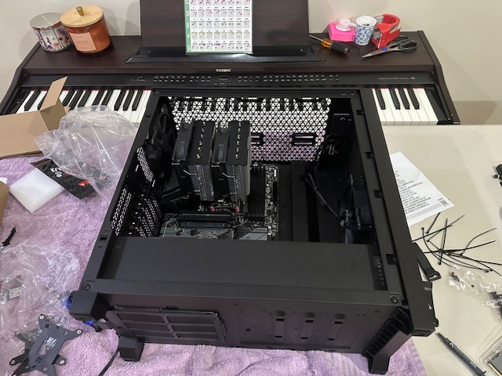
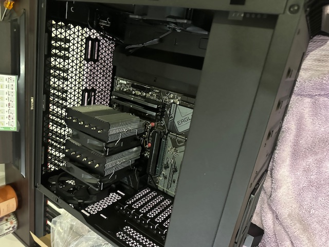
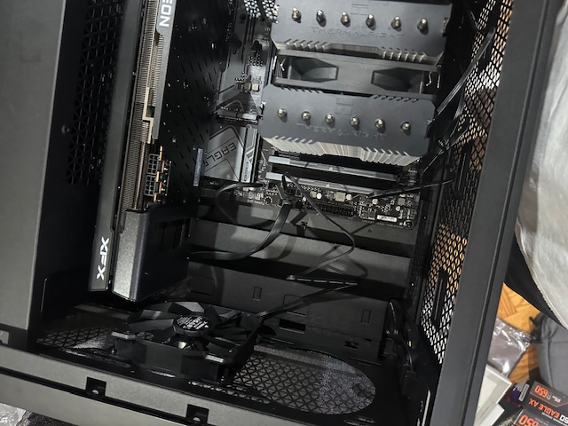
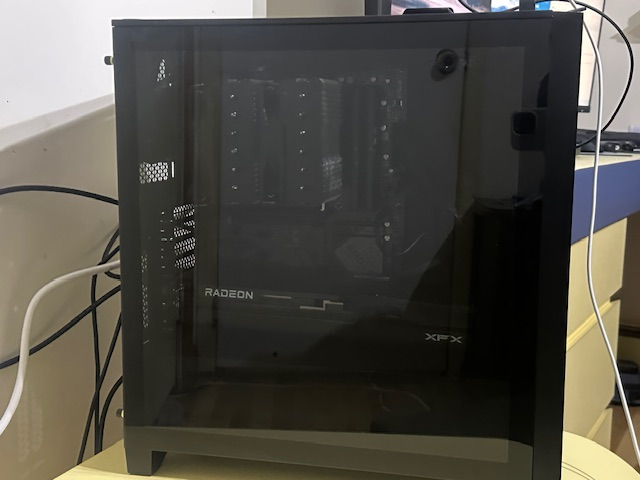
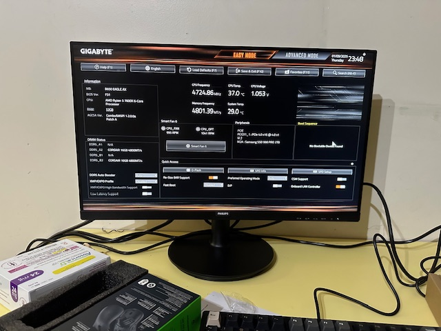
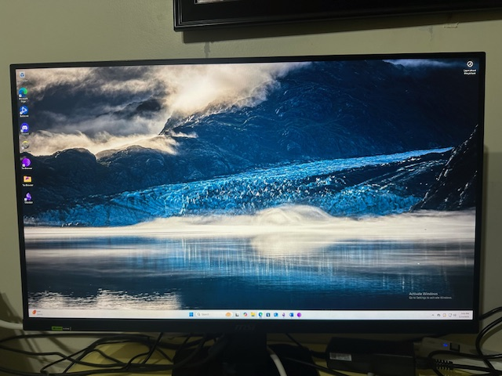

# Project 1: Building my Gaming PC

## Description:
This project aims to demostrate my hardware, software, OS installation, and troubleshooting knowledge.

This project will present some of the steps I took to build the PC via screenshots.

[To go back to the main page](../index.md)

<h2 style="text-align: center">PC Part List</h2>

<h2 style="text-align: center">Workstation</h2>

<h2 style="text-align: center">Installing CPU</h2>

<h2 style="text-align: center">Installing Motherboard</h2>

<h2 style="text-align: center">Installing Cooling Workstation</h2>

<h2 style="text-align: center">Installing RAM</h2>

Note: If I were to build another PC, I would have install the the CPU, SSD, and the RAM before installing it in the motherboard. 

Given that it became awkward installing the RAM with the Cooling in the way. 

I learn to install all of the lighter parts on the motherboard before installing it on the case.

<h2 style="text-align: center">Installing GPU</h2>

## Final Product 

<h2 style="text-align: center">Final Product</h2>

<h2 style="text-align: center">Booting into UEFI</h2>

<h2 style="text-align: center">Installing Windows</h2>

[To go back to the main page](../index.md)

### Contact Information:
     
